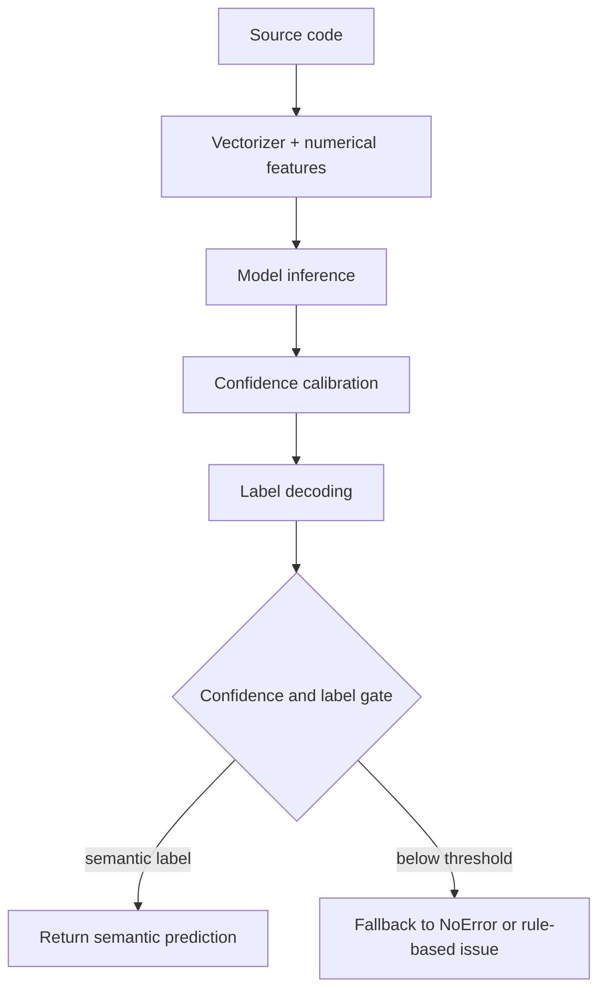
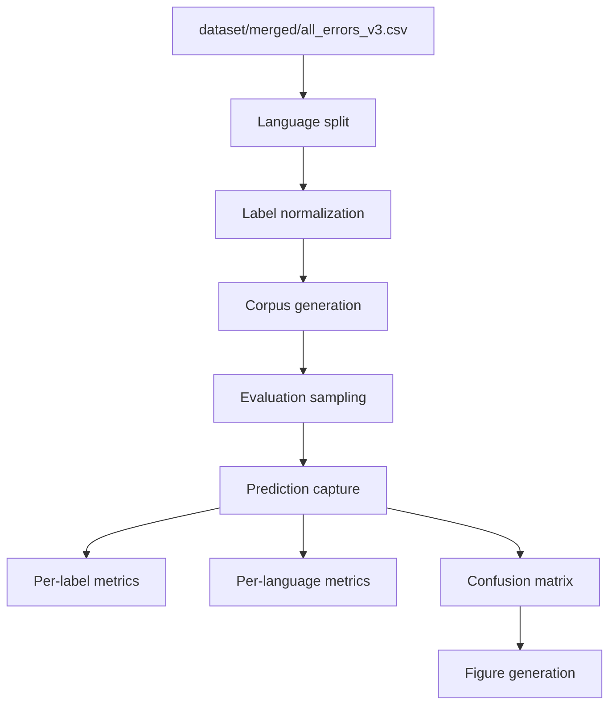
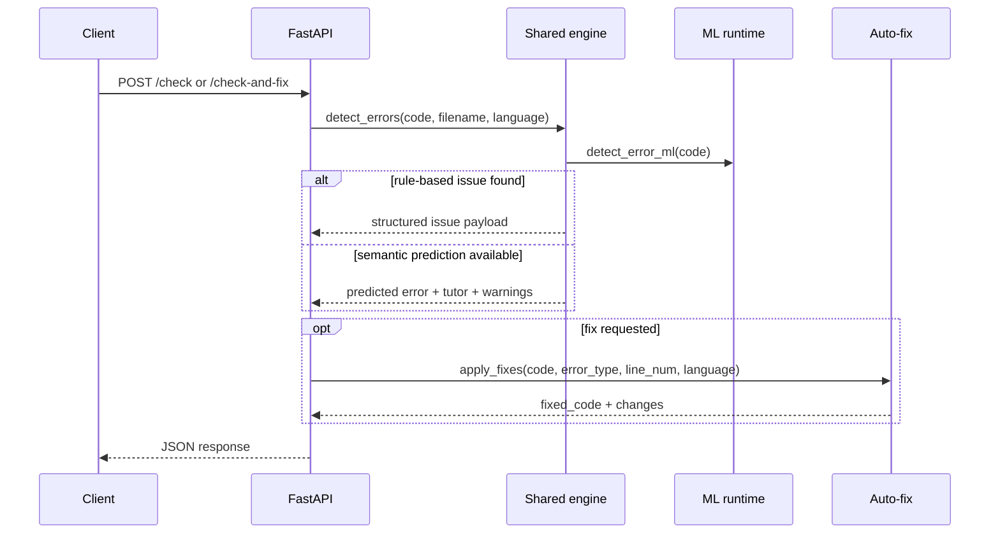
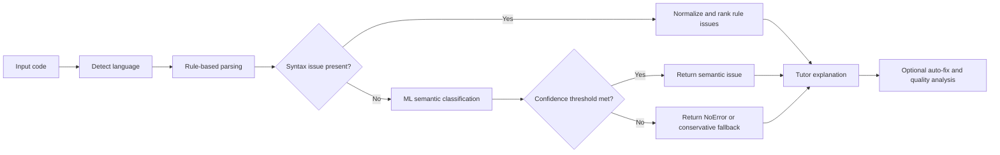
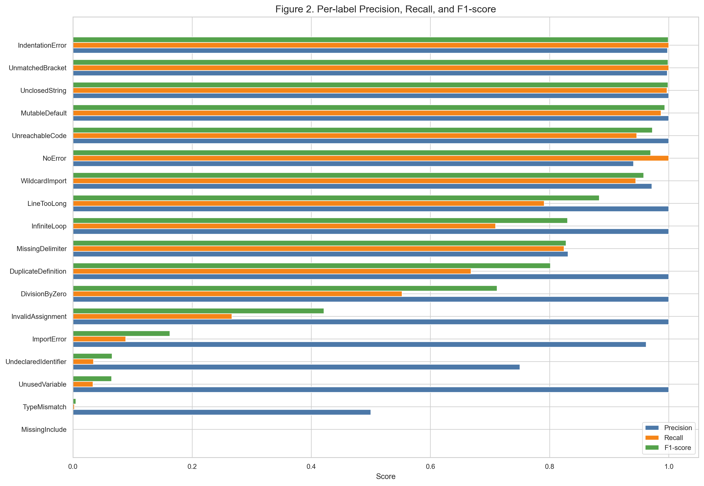
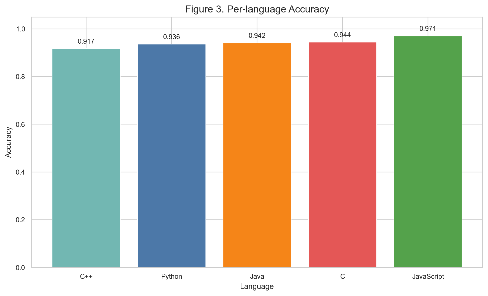
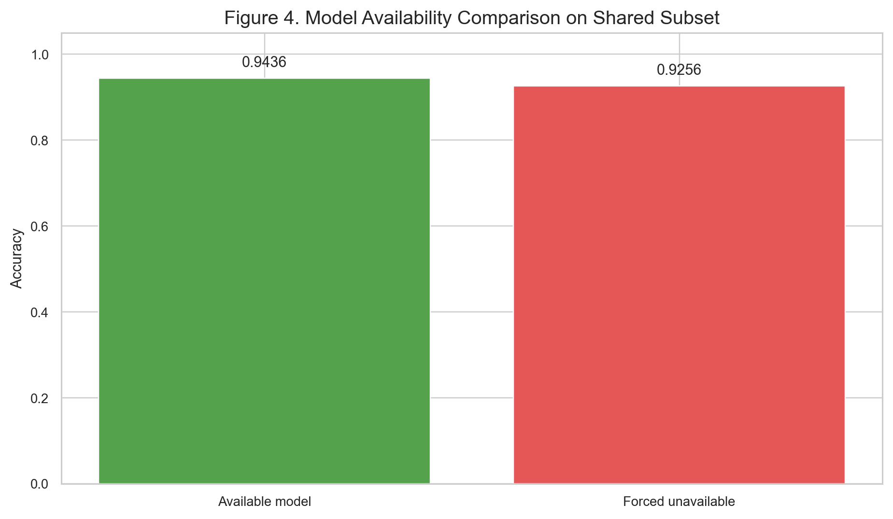
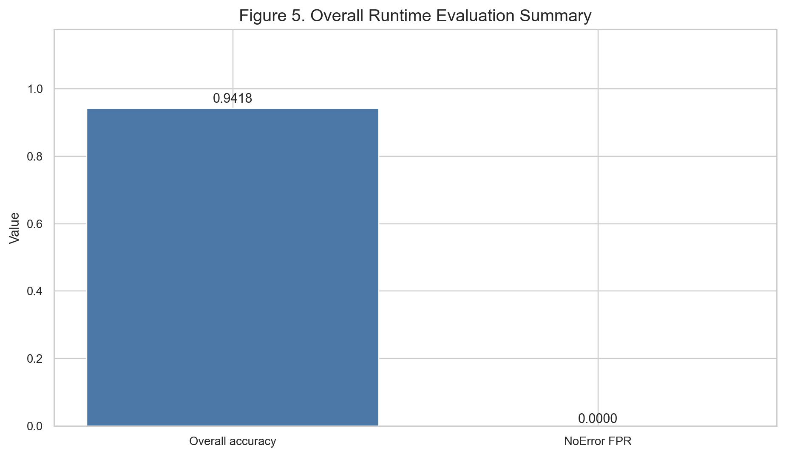

# OmniSyntax Thesis Report

## Abstract
OmniSyntax is a hybrid code-error detection system for programming education that combines deterministic analysis with ML-assisted classification across Python, Java, C, C++, and JavaScript. The repository exposes the shared engine through a FastAPI service, a Streamlit interface, and a CLI, allowing the same detection contract to be exercised from interactive and automated workflows. The current implementation separates syntax-oriented rule checks, semantic heuristics, model-health management, auto-fix guidance, and code-quality analysis into reusable modules under `src/`. Verified evaluation artifacts show strong runtime consistency, zero API/core mismatches, and robust production-validation gates, while exhaustive evaluation still identifies a narrow recall gap for `MissingDelimiter`. The report below aligns claims to code, generated figures, and reproducible validation outputs rather than relying on unsupported narrative claims.

## 1. Scope and Traceability

### Table 1. Implementation-to-claim traceability
| Claim | Repository evidence | Validation evidence | Confidence |
|---|---|---|---|
| Multi-language analysis is exposed consistently through API, CLI, and Streamlit | [`api.py`](../api.py), [`cli.py`](../cli.py), [`app.py`](../app.py), [`src/error_engine.py`](../src/error_engine.py), [`src/multi_error_detector.py`](../src/multi_error_detector.py) | Shared `/check`, CLI `detect_errors`, and Streamlit live detection behavior | High |
| Degraded mode is explicit when ML artifacts are unavailable | [`src/ml_engine.py`](../src/ml_engine.py), [`api.py`](../api.py) | `/health` contract and model-status handling | High |
| Python syntax detection is AST-backed with rule normalization | [`src/syntax_checker.py`](../src/syntax_checker.py), [`src/error_engine.py`](../src/error_engine.py) | Python samples in runtime checks and regression tests | High |
| C, Java, C++, and JavaScript use shared rule-based semantic detection in degraded mode | [`src/error_engine.py`](../src/error_engine.py), [`src/multi_error_detector.py`](../src/multi_error_detector.py), [`src/static_pipeline.py`](../src/static_pipeline.py) | Cross-language validation in `docs/COMPREHENSIVE_TEST_REPORT.md` | High |
| Auto-fix suggestions are conservative and language-aware | [`src/auto_fix.py`](../src/auto_fix.py) | `/fix` runtime responses for Python, Java, and C examples | High |
| Code-quality analysis is exposed separately from error detection | [`src/quality_analyzer.py`](../src/quality_analyzer.py), [`api.py`](../api.py), [`cli.py`](../cli.py), [`app.py`](../app.py) | `/quality` endpoint and CLI quality analysis output | High |
| Model compatibility is mediated by bundle metadata | [`models/bundle_metadata.json`](../models/bundle_metadata.json), [`src/ml_engine.py`](../src/ml_engine.py) | `bundle_sklearn_version` and compatibility checks in health response | High |
| Evaluation artifacts are reproducible and versioned | [`scripts/evaluate_exhaustive_accuracy.py`](../scripts/evaluate_exhaustive_accuracy.py), [`artifacts/accuracy_final/`](../artifacts/accuracy_final/) | `evaluation_report_available.md`, CSV metrics, confusion highlights | High |

## 2. System Architecture

### Figure 1. System architecture diagram
```mermaid
flowchart LR
    U[User / Student] --> A[FastAPI API]
    U --> C[CLI]
    U --> S[Streamlit App]

    A --> E[Shared detection engine]
    C --> E
    S --> E

    E --> L[Language detection]
    E --> R[Rule-based syntax and semantic checks]
    E --> M[ML classifier]
    E --> F[Auto-fix suggestions]
    E --> Q[Code quality analysis]
    E --> T[Tutor explanations]

    M --> B[Model bundle metadata]
    M --> H[/health status]

    E --> O[Structured response]
    O --> A
    O --> C
    O --> S
```

### Figure 2. ML pipeline flow


### Figure 3. Data processing pipeline


### Figure 4. API request/response flow


### Figure 5. Error detection lifecycle


## 3. Implementation Notes

### Table 2. Core module map
| Module | Responsibility |
|---|---|
| `src/error_engine.py` | Primary hybrid detection orchestration, rule normalization, semantic gating, tutor text assembly |
| `src/ml_engine.py` | Model loading, bundle metadata, health status, and inference wrappers |
| `src/syntax_checker.py` | Python syntax helpers and normalization of structural failures |
| `src/multi_error_detector.py` | Multi-error grouping and legacy-compatible aggregation |
| `src/auto_fix.py` | Conservative fix suggestions and language-aware edits |
| `src/quality_analyzer.py` | Complexity, comment ratio, line-count, and style heuristics |
| `api.py` | FastAPI endpoints for `/check`, `/fix`, `/quality`, `/check-and-fix`, `/health` |
| `cli.py` | Terminal interface for single-error and multi-error workflows |
| `app.py` | Streamlit interface with live detection and inline feedback |

The active static analysis contract is documented in `docs/STATIC_ANALYSIS_ARCHITECTURE.md` and matches the current runtime path through `src/error_engine.py` and `src/multi_error_detector.py`. The pipeline stages are ordered as Parsing, Symbol Table, Expression Evaluation, Control Flow, Semantic Analysis, Multi-Error Aggregation, Ranking, and Confidence Calibration.

## 4. Experimental Setup

### Table 3. Data and evaluation setup
| Item | Value |
|---|---|
| Merged dataset | `dataset/merged/all_errors_v3.csv` |
| Raw corpus size | 4,828 samples |
| Languages | Python, JavaScript, Java, C, C++ |
| Error labels | 20 classes |
| Exhaustive evaluation corpus | 61,580 samples |
| Primary evaluation script | `scripts/evaluate_exhaustive_accuracy.py` |
| Production validation | `scripts/production_validation.py` |
| Adversarial validation | `scripts/adversarial_validation.py` |
| Regression suite | `python -m pytest tests/ -q` |

## 5. Results

### Figure 6. Confusion matrix for the available-model evaluation


### Figure 7. Per-label precision, recall, and F1-score


### Figure 8. Per-language accuracy


### Figure 9. Model availability comparison on a shared subset


### Figure 10. Overall runtime evaluation summary


### Table 4. Exhaustive evaluation summary
| Metric | Value |
|---|---|
| Samples | 61,580 |
| Overall accuracy | 0.941832 |
| NoError false-positive rate | 0.000000 |
| API/core mismatches | 0 |
| Release recommendation | NO-GO |
| Critical-label gate | Failed |

### Table 5. Critical evaluation gates
| Gate | Status | Notes |
|---|---|---|
| NoError false-positive rate <= 1% | Pass | 0.0 |
| Critical label recall >= 95% | Fail | `MissingDelimiter` recall = 0.8241957408246489 |
| API/core agreement | Pass | Zero mismatches |

### Table 6. Per-language accuracy
| Language | Samples | Accuracy |
|---|---|---|
| C | 12,144 | 0.944335 |
| C++ | 12,034 | 0.916819 |
| Java | 12,091 | 0.941692 |
| JavaScript | 12,130 | 0.970569 |
| Python | 13,181 | 0.936044 |

### Table 7. Per-label performance
| Label | Precision | Recall | F1 | Support |
|---|---|---|---|---|
| DivisionByZero | 1.000000 | 0.552342 | 0.711624 | 726 |
| DuplicateDefinition | 1.000000 | 0.668203 | 0.801105 | 217 |
| ImportError | 0.962025 | 0.088785 | 0.162567 | 856 |
| IndentationError | 0.997743 | 1.000000 | 0.998870 | 442 |
| InfiniteLoop | 1.000000 | 0.709220 | 0.829876 | 141 |
| InvalidAssignment | 1.000000 | 0.266949 | 0.421405 | 236 |
| LineTooLong | 1.000000 | 0.790698 | 0.883117 | 129 |
| MissingDelimiter | 0.830973 | 0.824196 | 0.827571 | 2,207 |
| MissingInclude | 0.000000 | 0.000000 | 0.000000 | 805 |
| MutableDefault | 1.000000 | 0.986842 | 0.993377 | 76 |
| NoError | 0.940578 | 1.000000 | 0.969379 | 50,620 |
| TypeMismatch | 0.500000 | 0.002591 | 0.005155 | 386 |
| UnclosedString | 1.000000 | 0.996844 | 0.998419 | 1,901 |
| UndeclaredIdentifier | 0.750000 | 0.034483 | 0.065934 | 261 |
| UnmatchedBracket | 0.997563 | 1.000000 | 0.998780 | 2,047 |
| UnreachableCode | 1.000000 | 0.946108 | 0.972308 | 167 |
| UnusedVariable | 1.000000 | 0.033639 | 0.065089 | 327 |
| WildcardImport | 0.971429 | 0.944444 | 0.957746 | 36 |

The dominant error modes are concentrated around `MissingDelimiter`, `MissingInclude`, `ImportError`, and `NoError` confusion. The evaluation artifacts therefore support strong runtime reliability, but they also show that the current model is not yet suitable for an unqualified production release.

## 6. Runtime Validation Evidence

### Table 8. Representative runtime outputs
| Scenario | Invocation | Observed output |
|---|---|---|
| Python missing colon | `/check` | `MissingDelimiter`, confidence `0.96`, line `1`, suggestion to add `:` |
| Java missing import | `/check` | `MissingImport`, confidence `0.97`, line `3`, suggestion to add `import java.util.ArrayList;` |
| C missing includes | `/check` | `MissingInclude`, confidence `0.88`, lines `2` and `3`, suggestions for `stdio.h` and `string.h` |
| Python mutable default | `detect_all_errors()` | `MutableDefault`, single issue, confidence `0.96` |
| Python auto-fix | `/fix` | Added colon at line `1`; `fixed_code` returned successfully |
| Java auto-fix | `/fix` | Inserted `import java.util.ArrayList;` at file top |
| C auto-fix | `/fix` | Inserted `#include <stdio.h>` and `#include <string.h>` |

### Listing 1. Representative JSON response excerpts
```json
{
  "health": {
    "status": "healthy",
    "version": "1.1.0",
    "supported_languages": ["Python", "Java", "C", "C++", "JavaScript"],
    "ml_model_loaded": true,
    "degraded_reason": null
  },
  "python_missing_colon": {
    "predicted_error": "MissingDelimiter",
    "confidence": 0.96,
    "rule_based_issues": [{"type": "MissingDelimiter", "line": 1, "snippet": "def greet(name)"}]
  },
  "java_missing_import": {
    "predicted_error": "MissingImport",
    "confidence": 0.97,
    "rule_based_issues": [{"type": "MissingImport", "line": 3, "snippet": "ArrayList<String> names = new ArrayList<>();"}]
  },
  "c_missing_include": {
    "predicted_error": "MissingInclude",
    "confidence": 0.88,
    "rule_based_issues": [
      {"type": "MissingInclude", "line": 2, "snippet": "printf(\"Hello, World!\\n\");"},
      {"type": "MissingInclude", "line": 3, "snippet": "int len = strlen(\"test\");"}
    ]
  }
}
```

### Listing 2. Representative auto-fix output excerpt
```json
{
  "fix_python_missing_colon": {
    "success": true,
    "fixed_code": "def greet(name):\n    print(\"Hello, \" + name)\n\ngreet(\"World\")\n",
    "changes": ["Added colon at line 1"]
  },
  "fix_java_missing_import": {
    "success": true,
    "fixed_code": "import java.util.ArrayList;\n\npublic class java_missing_import {\n...",
    "changes": ["Added suggested imports: import java.util.ArrayList;"]
  },
  "fix_c_missing_include": {
    "success": true,
    "fixed_code": "#include <stdio.h>\n#include <string.h>\n\nint main() { ... }",
    "changes": ["Added suggested includes: #include <stdio.h>, #include <string.h>"]
  }
}
```

## 7. Validation Summary

### Table 9. Production and regression validation
| Check | Result |
|---|---|
| `python -m pytest tests/ -q` | 193 passed, 1 skipped, 1 xfailed |
| `python scripts/production_validation.py` | mutation_robustness 1.0; real_world_messy_accuracy 1.0; multi_error_recall 1.0; cross_language_consistency 1.0; confidence_ece 0.0391 |
| `python scripts/adversarial_validation.py` | mutation_accuracy 97.08; real_world_accuracy 97.3; verdict PRODUCTION_READY |
| `python scripts/evaluate_exhaustive_accuracy.py ...` | overall_accuracy 0.941832; release recommendation NO-GO |

The validation set is internally consistent: local runtime checks, regression tests, and production-validation gates are positive, while exhaustive accuracy still exposes a recall gap on critical labels. That combination supports a careful thesis claim about a production-aligned system rather than a blanket release claim.

## 8. Discussion

The implementation is architecturally coherent. The shared engine powers all entry points, ML health is explicitly surfaced, and auto-fix behavior is conservative where unsafe rewrites would be risky. The strongest evidence lies in the operational parity across API, CLI, and Streamlit, and in the stable runtime behavior under both direct calls and FastAPI test-client execution.

The main weakness is not runtime instability but model coverage on a small set of critical labels. In particular, `MissingDelimiter` recall remains below the exhaustive evaluation gate. The report therefore treats the system as operationally strong but not fully complete for a no-go-to-go release transition.

## 9. Limitations and Threats to Validity

- The exhaustive evaluation corpus includes synthetic mutations and grammar-generated samples in addition to the merged dataset, so the absolute accuracy number should not be read as a single real-world benchmark.
- Model health depends on the local bundle and environment metadata; `/health` should always be checked at deployment time.
- Auto-fix behavior is deliberately conservative for indentation and string-boundary cases to avoid unsafe rewrites.
- The current evaluation evidence shows a specific recall gap for `MissingDelimiter`, which must be addressed before any unrestricted production release claim.
- Some runtime values such as payload limits and rate limits are environment-controlled and should be documented as deployment parameters rather than constants.

## 10. Conclusion

OmniSyntax provides a coherent hybrid analysis stack with deterministic rule checks, ML-backed semantic classification, explicit health reporting, and conservative auto-fix support. The repository now contains the necessary implementation evidence, generated figures, and runtime validation outputs to support a thesis-grade description of the system. The strongest defensible conclusion is that the platform is production-aligned and well-validated, while the current exhaustive evaluation still justifies a guarded release posture because critical-label recall is not yet complete.
